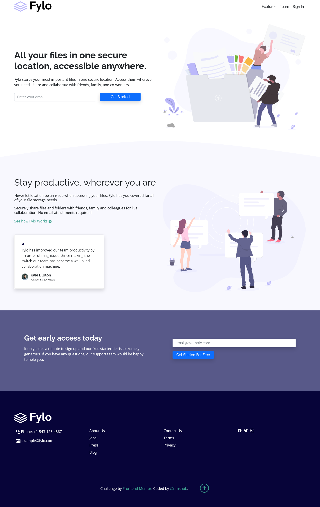
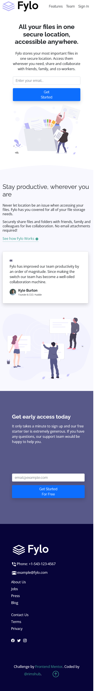

# Frontend Mentor - Fylo landing page with two column layout solution

This is a solution to the [Fylo landing page with two column layout challenge on Frontend Mentor](https://www.frontendmentor.io/challenges/fylo-landing-page-with-two-column-layout-5ca5ef041e82137ec91a50f5). 

## Table of contents

- [Overview](#overview)
  - [The challenge](#the-challenge)
  - [Screenshot](#screenshot)
  - [Links](#links)
- [My process](#my-process)
  - [Built with](#built-with)
  - [What I learned](#what-i-learned)
  - [Useful resources](#useful-resources)
- [Author](#author)

## Overview

### The challenge

- Fylo landing page with two column layout
- View the optimal layout for the site depending on their device's screen size
- See hover states for all interactive elements on the page

### Screenshot

- Desktop and Mobile View 

### Links

- Solution URL: [Code](https://github.com/rimshub/fylo-landing-page)
- Live Site URL: [Fylo Landing Page](https://tender-albattani-4f8ca9.netlify.app/)

## My process

### Built with

- Semantic HTML5 markup
- [Bootstrap v5.0](https://getbootstrap.com/docs/5.0/getting-started/introduction/) - CSS framework
- CSS custom properties

### What I learned

 - I Learned Bootstrap v5.0. 
 - I learn how to add custom CSS to bootstrap to change look according to the requirement. 

### Useful resources

- [Documentation of Bootstrap v5.0](https://www.example.com) - It helps to find out how to implement a specific thing in bootstrap. I think this is all required and need to learn bootstrap!

## Author

- Github - [Rimsha](https://github.com/rimshub)
- Frontend Mentor - [@rimshub](https://www.frontendmentor.io/profile/rimshub)

